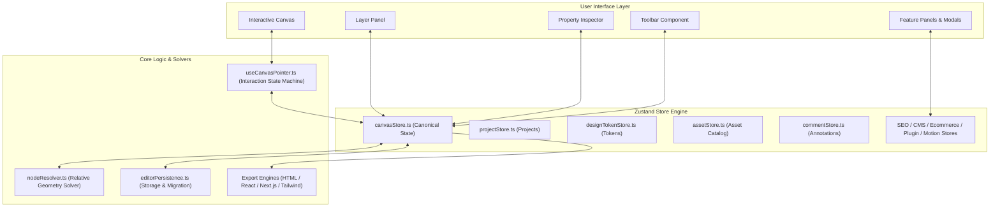

# Create Website Canvas 🎨⚡

> An enterprise-grade, browser-first visual website builder and canvas editor built with **React 19**, **TypeScript**, **Vite**, and **Zustand**. 

Create Website Canvas bridges the gap between visual design tools (like Figma or Webflow) and production-ready code generation. It enables developers and designers to build responsive, structured web layouts visually while seamlessly exporting zero-dependency **HTML/CSS**, **React 19**, **Next.js (App Router)**, or **Tailwind CSS** project bundles.

---

## 🌟 Key Features

### 🖥️ Infinite Visual Canvas Engine
- **Precision Viewport**: Smooth pan ($Cmd/\text{Ctrl} + \text{Wheel}$) and zoom ($10\% - 500\%$) with grid canvas background.
- **Responsive Breakpoint Frame System**: Toggle dynamically between **Desktop** ($1440\text{px}$), **Tablet** ($768\text{px}$), and **Mobile** ($375\text{px}$) viewport bounds.
- **Smart Alignment & Snapping**: Real-time bounding-box alignment guides, distance distribution indicators, and grid snapping.
- **Visual Rulers & Guides**: Horizontal and vertical canvas pixel rulers with interactive zoom awareness.
- **Layer & Hierarchy Explorer**: Tree view panel for reordering, grouping, locking, hiding, renaming, and nesting canvas nodes.

---

### 🧩 20+ Node Types & Component Ecosystem
Create Website Canvas features a modular node renderer supporting diverse layout elements:

| Category | Node Types | Description |
| :--- | :--- | :--- |
| **Vectors & Shapes** | `RectNode`, `CircleNode`, `StarNode`, `PolygonNode`, `LineNode`, `CurveNode`, `PathNode`, `Shape3DNode` | Geometric vectors with customizable fill, stroke, corner radius, opacity, and SVG path editing. |
| **Text & Media** | `TextNode`, `ImageNode`, `EmbedNode`, `IconNode` | Styled typography, responsive image frames (cover/contain/fill), iframe/video embeds, and vector icons. |
| **Layout & Containers** | `GroupNode`, `LayoutActionNode`, `PageSectionNode` | Multi-node grouping, accordions, tab views, sidebars, hero headers, and pre-built responsive section templates. |
| **Form Controls** | `FormControlsNode` | Interactive inputs, action buttons, checkboxes, radio groups, dropdown selects, and textareas. |
| **Wayfinding** | `NavWayfindingNode` | Dynamic navigation bars, breadcrumb trails, page pagination, and mobile menus. |
| **Data Display** | `DataDisplayNode` | Responsive data tables, metric stat cards, feature lists, and status badges. |
| **Feedback & Overlays**| `FeedbackOverlayNode` | Accessible modal dialogs, alert notifications, toast popups, and progress bars. |

---

### 🚀 Production-Ready Code Exporters (0 Dropped Properties)
Export fully operational codebases directly from your browser in one click:

1. **Clean HTML5 & CSS3**: Pure semantic markup with relative parent-child box layout math, avoiding nested geometry drift or absolute coordinate bugs.
2. **React 19 + TypeScript**: Modular, typed React component tree exports with prop structures.
3. **Next.js (App Router)**: Complete Next.js project layout with `app/page.tsx`, CSS Modules, and page route configs.
4. **Tailwind CSS**: Direct utility-class mapping for spacing, typography, grid layouts, and color palettes.
5. **Figma & JSON Interop**: Import/export complete canvas state trees as JSON payloads.
6. **ZIP Bundle Generator**: Built-in `JSZip` exporter packages code, styles, assets, and project files instantly.
7. **Canvas Snapshots**: Direct PNG and SVG image rendering export.

---

### 🛠️ Enterprise Design System & Extensions

- **Design Tokens**: Centralized token management for global color palettes, typography scales, spacing units, border radii, and drop shadows.
- **Reusable Component Library**: Convert canvas element subtrees into reusable component templates.
- **Asset Manager**: Centralized media library with file drag-and-drop uploading and data-URL caching.
- **Boolean Vector Operations**: Perform vector Union, Subtract, Intersect, and Exclude operations on shape groups.
- **SEO & Social Metadata**: Configure meta titles, descriptions, Open Graph preview tags, canonical URLs, and JSON-LD structured data.
- **Visual Comment Annotations**: Drop pin comments anywhere on canvas coordinates with thread resolution and author avatars.
- **Snapshot Version History**: Bounded undo/redo history stack alongside project checkpoint restoration.
- **Multiplayer Cursor Cursors**: Simulated real-time collaboration cursors and shareable project link modals.

---

## 🏗️ Architecture & State Model

### System Architecture Overview



---

### 1. Canonical State Model (`src/store/canvasStore.ts`)
The entire visual editor is driven by a single canonical state model powered by Zustand. This eliminates state duplication and data drift across canvas views, layer trees, property inspectors, and export pipelines.

- **Flat Node Lookup Graph (`NodesById`)**: Canvas nodes are stored in a flat key-value dictionary (`Record<string, CanvasNode>`). Tree hierarchy is maintained through `parentId` references and parent `children` ID arrays.
- **Page Collection Router (`PagesById`)**: Multi-page projects store page models indexed by `pageId`, each containing node graphs, metadata, and page slug definitions.
- **Viewport State (`Viewport`)**: Manages pan offsets (`panX`, `panY`), scale zoom levels (`zoom`), and current breakpoint overrides (`desktop` | `tablet` | `mobile`).
- **Bounded History Stack (`HistoryStack`)**: Manages undo/redo snapshot trees with bounded stack size limits, batching fast pointer movements (such as dragging or resizing) into cohesive history steps.
- **Selection & Grouping State**: Manages multi-node selection arrays (`selectedNodeIds`) and enforces group invariants (preventing cyclic parent loops and invalid child nesting).

---

### 2. Data Persistence & Migration Service (`src/services/editorPersistence.ts`)
Persistence is cleanly decoupled from component behavior:
- **Storage Serialization Isolation**: Direct `localStorage` calls are isolated behind `editorPersistence.ts`. Component handlers never directly touch browser storage.
- **Schema Validation & Migration**: Incoming project files and stored sessions pass through an automated validation phase. Outdated project schemas undergo sequential migration to current data contracts.
- **State Sanitization**: Derived UI flags (such as context menu state or active drag previews) are stripped prior to serialization, storing only raw canonical models.

---

### 3. Relative Geometry & Layout Resolver (`src/utils/nodeResolver.ts`)
Canvas rendering and code generation rely on a pure functional layout solver (`nodeResolver.ts`):
- **Relative Box Resolution (`resolveNodeBox`)**: Converts absolute canvas coordinates into parent-relative offsets when nodes are grouped inside container nodes (`isChildOfGroup`), preventing double-offset rendering bugs.
- **Breakpoint Overrides**: Resolves geometry and styling properties based on the active breakpoint (`desktop`, `tablet`, or `mobile`), applying responsive layout overrides dynamically.
- **Style & Content Resolution (`resolveNodeStyle`, `resolveNodeContent`)**: Normalizes style properties (fills, strokes, typography, borders, shadows) and content props (text strings, image URLs, switch flags) across all node types.
- **Render Tree Hierarchy (`getRenderTree`)**: Recursively sorts top-level and nested child nodes by z-index order (`order`), building the render hierarchy.

---

### 4. Specialized Auxiliary Stores Ecosystem
Beyond the core canvas, specialized Zustand stores handle domain-specific feature modules:

| Store File | Responsibilities |
| :--- | :--- |
| **`projectStore.ts`** | Project CRUD operations, project switching, local storage persistence, and export preset metadata. |
| **`designTokenStore.ts`** | Centralized design system tokens (color palettes, font stacks, font sizes, line heights, radii, shadow presets). |
| **`assetStore.ts`** | Media catalog management, image file uploading, data-URL encoding, and asset selection listeners. |
| **`componentStore.ts`** | Reusable UI component definitions, master component templates, and instance bindings. |
| **`commentStore.ts`** | Coordinates canvas coordinate pin comments, comment threads, author avatar colors, and resolution states. |
| **`seoStore.ts`** | Open Graph metadata, title/description templates, canonical URL targets, and JSON-LD structured schemas. |
| **`cmsStore.ts`** | Content collections, custom field schemas (text, image, boolean), and dynamic node content bindings. |
| **`ecommerceStore.ts`** | Product catalog items, shopping cart drawer state, currency formatting, and checkout modal workflows. |
| **`motionStore.ts`** | Keyframe animation timelines, animation triggers (hover/click/scroll), easing functions, and scroll effects. |
| **`localizationStore.ts`** | Translation key-value dictionaries, locale selection (`en`, `es`, `fr`, `de`, `ja`), and dynamic text rendering. |
| **`pluginStore.ts`** | Plugin marketplace registry, installed extensions, webhook event triggers, and third-party script handlers. |
| **`collaborationStore.ts`** | Multiplayer peer cursor streams, share link generation, and mock socket state tracking. |
| **`versionStore.ts`** | Immutable project checkpoint snapshots, version history timeline, and snapshot restoration handlers. |

---

### 5. Interaction Pointer Machine (`src/hooks/useCanvasPointer.ts`)
Canvas interaction logic is encapsulated in a dedicated pointer event state machine:
- **Interaction Modes**: Manages active mouse/touch state modes (`select`, `pan`, `draw-rect`, `draw-line`, `drag-node`, `resize-node`, `rotate-node`).
- **Snapping Engine Integration (`src/utils/snapping.ts`)**: Evaluates node bounding boxes during drag and resize operations, snapping nodes to centerlines, edges, and equal distribution spacing guides.
- **Keyboard Listener (`src/hooks/useKeyboard.ts`)**: Intercepts shortcuts (`Cmd+Z`, `Cmd+Shift+Z`, `Cmd+G`, `Cmd+Shift+G`, `Delete`, arrow nudges) and dispatches clean store actions.

---

### 6. Multi-Framework Export Engine (`src/utils/export*.ts`)
Code exporters transform the internal node graph into clean, zero-dependency source code:
- **`exportSite.ts`**: Generates semantic HTML5 and clean CSS3 stylesheets, outputting clean relative layout rules.
- **`exportReact.ts`**: Emits typed React 19 JSX components with clean prop signatures.
- **`exportNextjs.ts`**: Generates Next.js App Router project structures (`app/page.tsx`, CSS modules, layout files).
- **`exportTailwind.ts`**: Maps visual styles (colors, flex layouts, spacing, rounded corners) into clean Tailwind CSS utility classes.
- **`exportZip.ts`**: Bundles generated source code, CSS, assets, and project files into a downloadable ZIP archive using `JSZip`.

---

### 7. Feature Flag & Scope Control (`src/config/productScope.ts`)
To prevent over-scoping and maintain browser performance:
- **Runtime Flag Gating**: `getEnabledFeatures()` evaluates active feature flags.
- **Modular MVP Isolation**: Core MVP features (Canvas, Layers, Properties, Projects, Exporters) remain active by default, while extended features (Auth, Collaboration, CMS, Ecommerce, Webhooks) are cleanly isolated behind toggles.

---

## 📂 Repository Structure

```
createwebsitecanvas/
├── docs/
│   └── solid-product-roadmap.md     # Architecture remediation & product roadmap
├── public/                          # Static public assets
├── src/
│   ├── assets/                      # Application icons & graphics
│   ├── components/                  # Core UI components
│   │   ├── nodes/                   # Renderers for all 20+ canvas node types
│   │   ├── panels/                  # Feature modals & side panels (SEO, Tokens, CMS, etc.)
│   │   ├── Canvas.tsx               # Main SVG/HTML interaction canvas
│   │   ├── LayerPanel.tsx           # Layer tree & layer controls
│   │   ├── PropertyPanel.tsx        # Multi-tab node property inspector
│   │   ├── Toolbar.tsx              # Top bar tool selection & action triggers
│   │   ├── StatusBar.tsx            # Zoom level, node counter, & canvas status
│   │   └── ExportModal.tsx          # Multi-format code export dialog
│   ├── config/
│   │   └── productScope.ts          # Feature flag system & product boundaries
│   ├── data/
│   │   └── iconLibrary.ts           # Curated SVG icon definitions
│   ├── hooks/
│   │   ├── useCanvasPointer.ts      # Mouse/touch pointer event state machine
│   │   └── useKeyboard.ts           # Keyboard shortcuts event listener
│   ├── services/
│   │   ├── editorPersistence.ts     # LocalStorage save/load adapter & schema validator
│   │   └── editorState.ts           # Canonical editor state boundaries
│   ├── store/
│   │   ├── canvasStore.ts           # Primary Zustand store (Pages, Nodes, Selection, Viewport)
│   │   ├── projectStore.ts          # Project workspace management
│   │   ├── designTokenStore.ts      # Global theme & token store
│   │   └── assetStore.ts            # Media & asset catalog store
│   ├── types/
│   │   └── canvas.ts                # TypeScript interfaces for Nodes, Geometry, Styles, & Pages
│   └── utils/
│       ├── nodeResolver.ts          # Pure layout & style resolver (Fidelity Parity)
│       ├── exportSite.ts            # HTML5/CSS3 export pipeline
│       ├── exportReact.ts           # React 19 component export pipeline
│       ├── exportNextjs.ts          # Next.js App Router export pipeline
│       ├── exportTailwind.ts        # Tailwind CSS export pipeline
│       ├── exportZip.ts             # JSZip client-side archive builder
│       └── runFidelityTest.ts       # Automated layout fidelity parity test suite
├── index.html                       # Entry HTML template
├── package.json                     # Project manifest & dependencies
├── vite.config.ts                   # Vite configuration
└── tsconfig.app.json                # Strict TypeScript configuration
```

---

## ⚡ Getting Started

### Prerequisites
- **Node.js**: `v18.0.0` or higher
- **npm**: `v9.0.0` or higher

### Installation

1. **Clone the repository**:
   ```bash
   git clone https://github.com/Imagiyy/Website-From-Canvas.git
   cd Website-From-Canvas
   ```

2. **Install dependencies**:
   ```bash
   npm install
   ```

3. **Start the development server**:
   ```bash
   npm run dev
   ```
   Open your browser at `http://localhost:5173`.

---

## 📜 Available Scripts

| Command | Action |
| :--- | :--- |
| `npm run dev` | Launches Vite local development server with HMR. |
| `npm run build` | Runs TypeScript type checking (`tsc -b`) and builds the production bundle into `dist/`. |
| `npm run preview` | Previews the production build locally. |
| `npm run lint` | Runs `oxlint` for lightning-fast JavaScript/TypeScript linting. |
| `npx tsx src/utils/runFidelityTest.ts` | Runs the automated fidelity parity test suite for canvas exporters. |

---

## ⌨️ Keyboard Shortcuts Cheat Sheet

| Shortcut | Action |
| :--- | :--- |
| `Space` + `Drag` / `Middle Click` | Pan around canvas viewport |
| `Cmd` / `Ctrl` + `Mouse Wheel` | Zoom in / out ($10\% - 500\%$) |
| `Cmd` / `Ctrl` + `Z` | Undo last canvas action |
| `Cmd` / `Ctrl` + `Shift` + `Z` | Redo action |
| `Cmd` / `Ctrl` + `G` | Group selected nodes into a parent container |
| `Cmd` / `Ctrl` + `Shift` + `G` | Ungroup selected container node |
| `Delete` / `Backspace` | Delete selected node(s) |
| `Arrow Keys` | Nudge selected node position ($1\text{px}$) |
| `Shift` + `Arrow Keys` | Nudge selected node position ($10\text{px}$) |
| `Esc` | Clear node selection |

---

## 🧪 Quality & Testing

This project incorporates automated verification checks for geometric rendering accuracy and export fidelity:

- **Fidelity Parity Suite**: Validates parent-child relative coordinate translation across all 4 export engines (`HTML`, `React`, `Next.js`, `Tailwind`) ensuring zero dropped properties.
- **Oxlint**: Modern high-performance linter maintaining code consistency.
- **TypeScript**: Strict type assertions covering node definitions, geometries, styles, and store payloads.

To execute the test suite:
```bash
npx tsx src/utils/runFidelityTest.ts
```

---

## 🛣️ Roadmap & Product Scope

Refer to [`docs/solid-product-roadmap.md`](file:///home/abrar/Documents/Websites/createwebsitecanvas/docs/solid-product-roadmap.md) for full architectural plans:

- [x] **Phase 1 (MVP - Completed)**: Canvas editor runtime, layer stack, property panel, project manager, local persistence, design tokens, asset manager, and 4 export engines.
- [ ] **Phase 2 (Secondary Modules)**: Expanded comments, SEO suite, motion timeline keyframing, and localizations.
- [ ] **Phase 3 (Enterprise & Cloud)**: Live multiplayer collaboration server, CMS data bindings, deployment pipeline integrations, and auth backends.

---

## 📄 License

This project is open-source under the MIT License.
